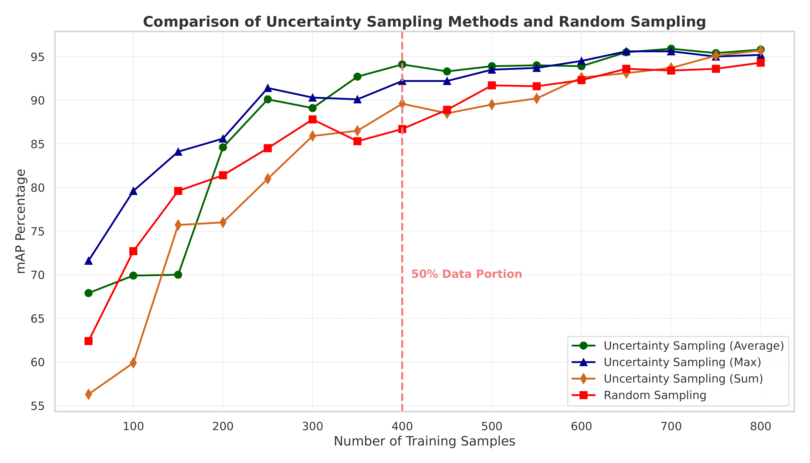

# Active_Learning_YOLOv9

This work introduces an innovative pipeline that effectively integrates Synthetic Data Generation with Active Learning (AL) algorithms to enhance the efficiency of real-world data acquisition and labeling. The proposed pipeline is structured into two distinct phases. The first phase, Synthetic Data Generation, involves creating high-fidelity synthetic data samples that closely mimic real-world scenarios, thereby augmenting the training dataset without extensive manual intervention. This phase establishes a strong foundational dataset that improves initial model performance and generalization. The second phase, Active Learning, utilizes AL techniques to selectively identify and label the most informative real-world data points, optimizing labeling efforts and reducing human labor. By focusing on these strategically chosen samples, the pipeline maximizes data acquisition efficiency and minimizes associated costs.

## Active Learning Methods Comparisions

This comprehensive figure compares all three Uncertainty Sampling strategies—Average, Max, and Sum against Random Sampling. It highlights the strengths and limitations of each method, showing how Uncertainty Sampling methods, particularly Average and Max, significantly accelerate model learning compared to Random Sampling, with the Sum method showing its value in extended training scenarios.

