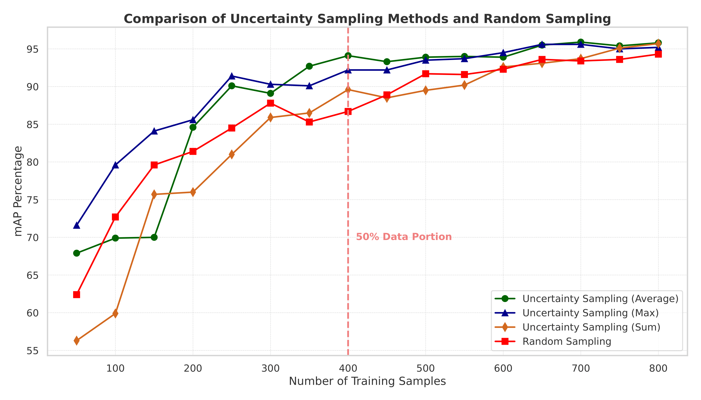
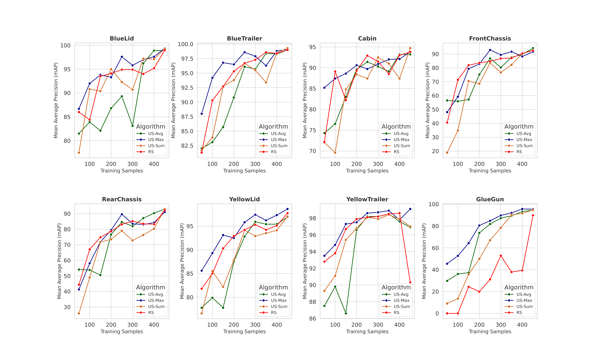
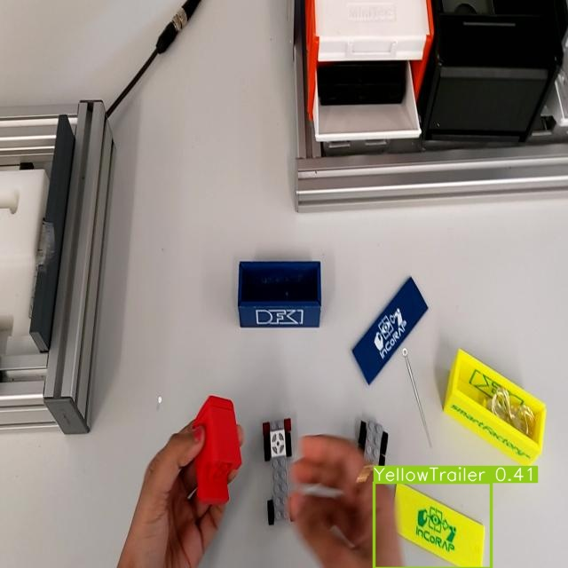
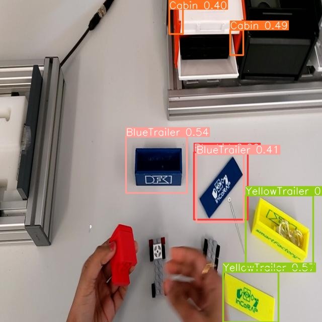
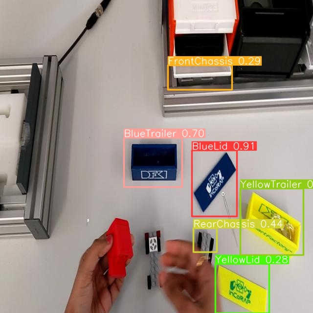
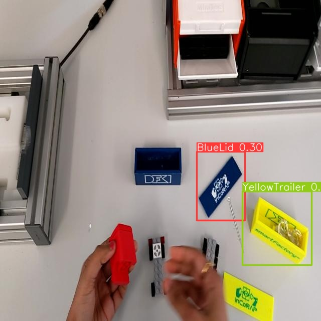
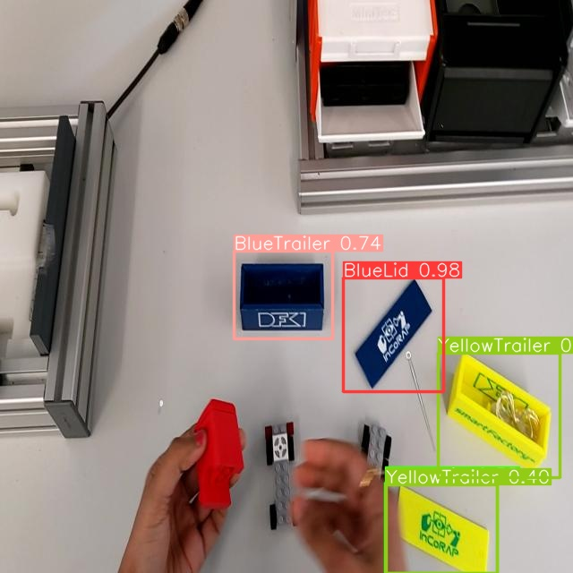
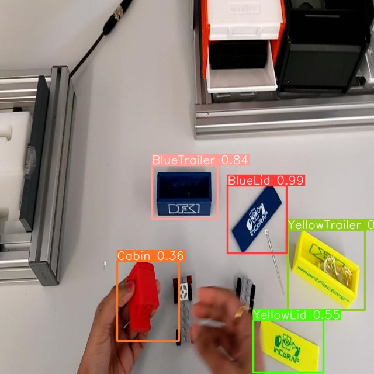
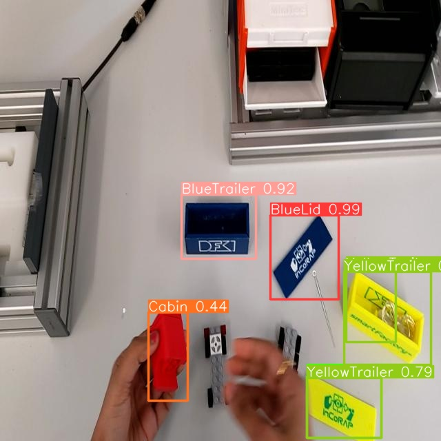
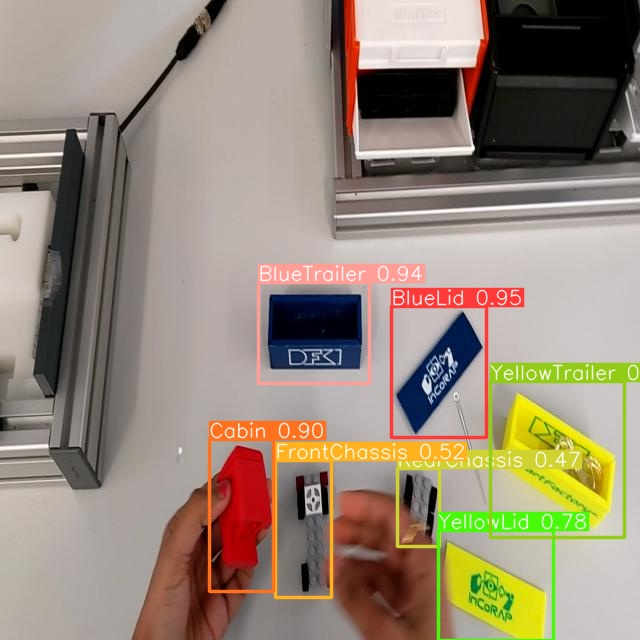

# Active Learning with YOLOv9

This project introduces an innovative pipeline that integrates Synthetic Data Generation with Active Learning (AL) algorithms to enhance the efficiency of real-world data acquisition and labeling. The pipeline is structured into two distinct phases:

### Phase 1: Synthetic Data Generation
- Create high-fidelity synthetic data samples that closely mimic real-world scenarios.
- Augment the training dataset without extensive manual intervention.
- Establish a strong foundational dataset to improve initial model performance and generalization.

### Phase 2: Active Learning
- Utilize AL techniques to selectively identify and label the most informative real-world data points.
- Optimize labeling efforts and reduce human labor.
- Focus on strategically chosen samples to maximize data acquisition efficiency and minimize associated costs.

---

## 📊 Active Learning Methods Comparison

This comprehensive comparison highlights all three Uncertainty Sampling strategies—**Average**, **Max**, and **Sum**—against **Random Sampling**. It demonstrates:

- **Average and Max** strategies significantly accelerate model learning compared to Random Sampling.
- **Sum** strategy shows its value in extended training scenarios.

---

## 📈 All Classes Comparison

This analysis provides a class-specific comparison of three Uncertainty Sampling strategies—**Average**, **Max**, and **Sum**—against **Random Sampling**. It covers performance across eight distinct classes, illustrating how each strategy handles various challenges.

---

## 🔍 Random Sampling vs. Uncertainty Sampling

Below is a visual comparison of training samples obtained through Random Sampling (RS) and Uncertainty Sampling (US). Training sample sizes range from 50 to 200 samples.

### Random Sampling (Top Row)

    

        
        
RS-50

    

    

        
        
RS-100

    

    

        
        
RS-150

    

    

        
        
RS-200

    

 

### Uncertainty Sampling (Bottom Row)

    

        
        
US-50

    

    

        
        
US-100

    

    

        
        
US-150

    

    

        
        
US-200

    

