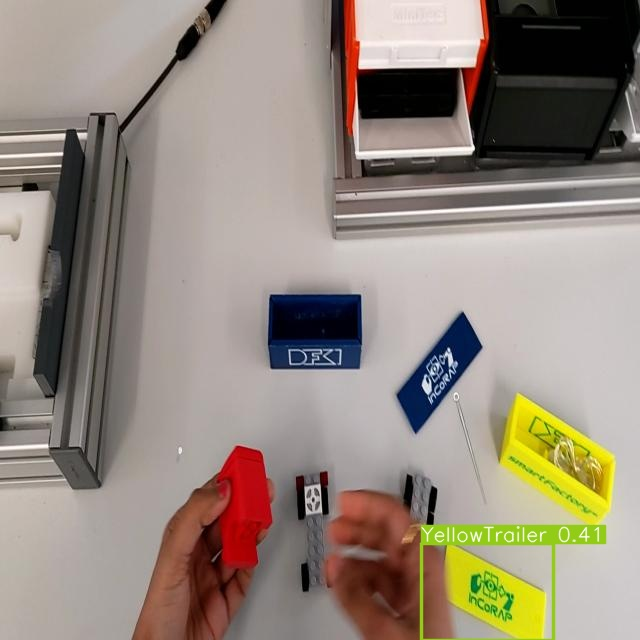

# Active_Learning_YOLOv9

This work introduces an innovative pipeline that effectively integrates Synthetic Data Generation with Active Learning (AL) algorithms to enhance the efficiency of real-world data acquisition and labeling. The proposed pipeline is structured into two distinct phases. The first phase, Synthetic Data Generation, involves creating high-fidelity synthetic data samples that closely mimic real-world scenarios, thereby augmenting the training dataset without extensive manual intervention. This phase establishes a strong foundational dataset that improves initial model performance and generalization. The second phase, Active Learning, utilizes AL techniques to selectively identify and label the most informative real-world data points, optimizing labeling efforts and reducing human labor. By focusing on these strategically chosen samples, the pipeline maximizes data acquisition efficiency and minimizes associated costs.

## Active Learning Methods Comparison

This comprehensive figure compares all three Uncertainty Sampling strategies—Average, Max, and Sum against Random Sampling. It highlights the strengths and limitations of each method, showing how Uncertainty Sampling methods, particularly Average and Max, significantly accelerate model learning compared to Random Sampling, with the Sum method showing its value in extended training scenarios.

## All Classes Comparison

This figure provides a comprehensive comparison of three Uncertainty Sampling strategies—Average, Max, and Sum—against Random Sampling. The analysis is conducted across eight distinct classes, illustrating the performance differences of each strategy in handling various class-specific challenges.

### Comparison of Random Sampling and Uncertainty Sampling

The top row presents images obtained through Random Sampling (RS), while the bottom row features images acquired using Uncertainty Sampling (US). Training sample sizes range from 50 to 200 samples.

<!-- First Row: Random Sampling Images -->

    

        
        
RS-50

    

    

        
        
RS-100

    

    

        
        
RS-150

    

    

        
        
RS-200

    

<!-- Space between rows -->
 

<!-- Second Row: Uncertainty Sampling Images -->

    

        
        
US-50

    

    

        
        
US-100

    

    

        
        
US-150

    

    

        
        
US-200

    

